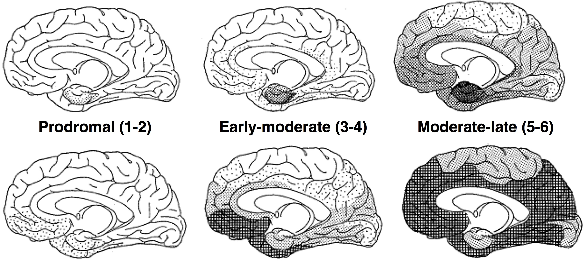
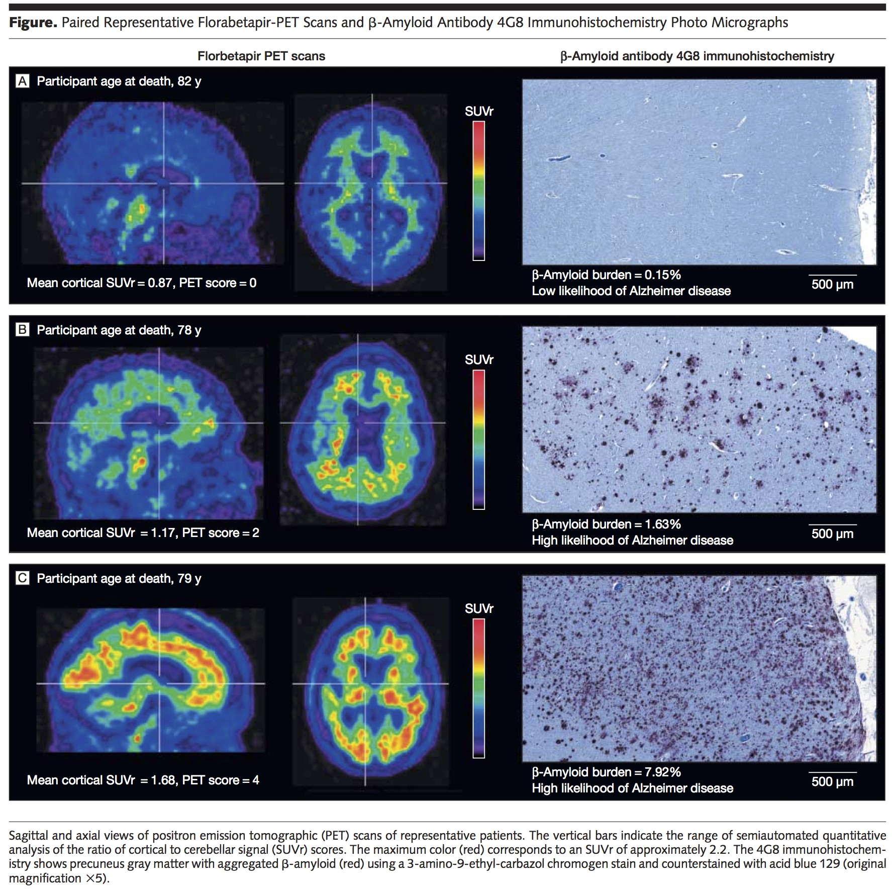
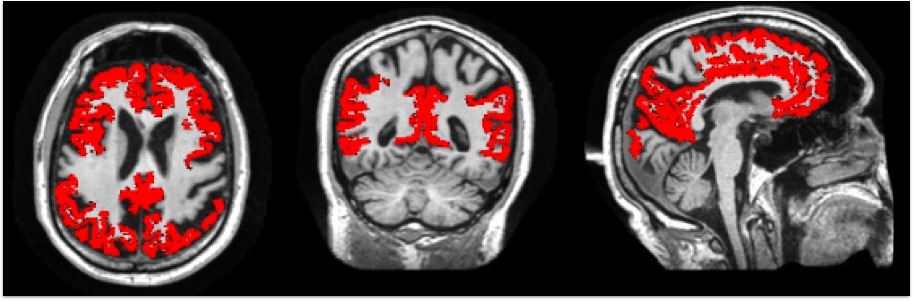
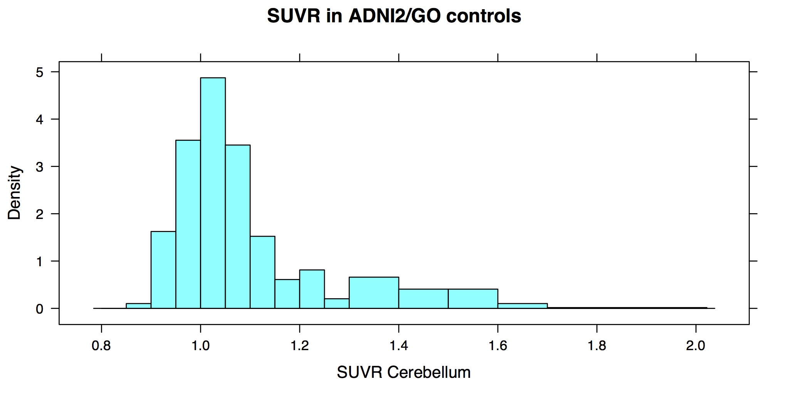
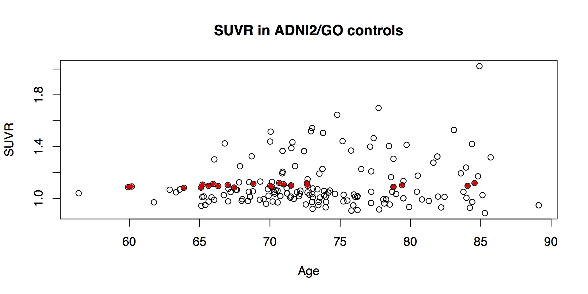

```{r, echo=FALSE,eval=TRUE}
library(tufte)
library( ANTsR )
```

## Overview of ADNI and Amyloid PET

`r tufte::newthought("The Alzheimer's disease neuroimaging initiative")` (ADNI)[^adni] collects and shares clinical and putative biomarker[^biom] data for AD in relation to normal aging.  Ideally, these biomarkers would be suggestive of not only the presence of AD pathology, but also the (Braak) stage of that pathology:



`r tufte::newthought("Only two biomarkers in ADNI are specific to amyloid pathology")`: florabetapir PET and cerebrospinal fluid measurements[^csftoledo] both of which relate to molecular scale processes.  AV45 binds primarily to the $\beta$ sheet structure of fibrillar amyloid with high affinity and also exhibits favorable pharmacokinetics[^f18].  AV45 is specific in that it does not bind to $\tau$ or $\alpha$-synuclein (present in ALS or Parkinson's disease). Note that these amyloid biomarkers do not always agree[^csfpet] but this is likely due to the increased sensitivity of CSF at earlier disease stages. Note: "patients in ADNI1 initially received PIB scans instead of Florbetapir scans. However, the protocol was amended before the conclusion of the study to include the adoption of Florbetapir scans over PIB scans due to processing time limits."


`r tufte::newthought("AV45 PET imaging is a validated method")` for estimating the likelihood of pathology that can only be verified *post mortem*.  Both visual read and SUVR based on a composite region of interest (Avid methodology) show high sensitivity and specificity in a moderately-sized dataset for detecting neuropathology.

[^exval]

## Interpreting ADNI biomarkers for AD

`r tufte::newthought("ADNI is far from definitive.")`  Perhaps the most important concern with ADNI is that we lack ground truth for not only pathology but also *in vivo* disease stage (a fundamental problem in the field).  Staging is not just a question of presence but also of *rate* i.e. _time to conversion_. Amyloid pathology may be present *without incipient clinical symptoms* (up to 25 years in familial AD)[^mm]. The ADNI cohort is "super-normal", i.e. not representative of the general population.  Furthermore, ADNI data quality `r margin_note("compromised by sequence availability")` may not always reach "gold-standard" for that methodology, e.g. DTI or ASL acquisitions and anatomical labeling protocols. `r margin_note("Freesurfer is a marginal performer wrt anatomical labeling")`  ADNI also lacks an explicit measurement of the distribution of $\tau$ pathology[^tau] (another general problem in the field).  Lastly, the ADNI SUVR recommendations are not validated against pathology but instead performance is inferred across different models.  That being said, ADNI is the most mature and comprehensive resource in the USA for investigating *in vivo* predictors of AD pathology. 

`r tufte::newthought("Only neuropathological evaluation can confirm AD.")`  CSF and PET provide surrogate measures.  The "gold standard" interpretation of the amyloid PET is currently the visual (consensus) read in which the viewer(s) compares uptake in several different regions.  The SUVR measurement is a "silver standard" in comparison to visual read but both diagnostics must reference post-mortem in validation studies. `r margin_note("confirmation of an AD biomarker requires post-mortem data examined with immunohistochemistry or related methods")`

`r tufte::newthought("The first Avid AV45 study")` showed 100\% specificity and 93\% sensitivity for detecting AD pathology (28 of 29 cases correct, 14 of 15 with AD pathology and $+$ PET scans).  In contrast, clinical diagnosis misclassified 3 subjects.  Interestingly, SUVR thresholded at 1.1 appears to yield perfect classification (cf. Table 1, Clark et al.). `r tufte::margin_note("35 patients, 6 for training, 74 controls (all negative), 96 percent accuracy")`

`r tufte::newthought("SUVR seeks to compare diseased with normal brain regions")` by taking a ratio of uptake values.  *It does not mimic visual read*.
```{marginfigure}
$\text{SUVR}^{JagustADNI} = \frac{\text{count}_\text{composite region}}{\text{count}_\text{cerebellum}}$
```
\noindent This simple equation may be more complex than it appears.  Assuming a PET acquisition exists (which is a spatiotemporal image), we perform the following steps to enable SUVR calculation:

* motion correction;

* spatiotemporal smoothing;

* registration (or mapping) to brain structure *within subject* and *to a group template brain* `r margin_note("canonical templates provide a labeled brain-centric coordinate system")`;

* segmentation of tissues and parcellation of neuroanatomy;

* a hypothesis about what parts of the brain should be considered "normal" (denominator) versus those that should be considered "diseased" (numerator).

`r tufte::newthought("The Jagust lab processing")` for ADNI recommends a cutoff of 1.11 based on the following steps:

* spatiotemporal smoothing with an 8mm (?) FWHM kernel;

* registration with `SPM5` to brain structure *within subject* and *to a group template brain* with `Freesurfer`;

* segmentation of tissues and parcellation of neuroanatomy with `Freesurfer`;

* recommend cerebellum as control region and a composite region of interest comprising frontal, lateral parietal, lateral temporal and anterior and posterior cingulate cortices **in subject space** (not template space);



Compare to template space:
```{r antsr,echo=FALSE, warning=FALSE,message=FALSE}
mni = antsImageRead( getANTsRData( "ch2" ) )
ch2 = antsImageRead( "./adniTemplate/T_template0.nii.gz" )
ch2seg = antsImageRead( "./adniTemplate/antsMalfLabeling_6Labels.nii.gz" )
ch2a = antsImageRead( "./adniTemplate/antsMalfLabeling.nii.gz"  )
invisible( plot( ch2 , domainImageMap=mni ) )
invisible( plot( ch2, ch2seg, domainImageMap=mni  ) )
invisible( plot( ch2, ch2a , domainImageMap=mni ) )
```
\noindent The recommended SUVR values are provided in a variable called `SUMMARYSUVR_WHOLECEREBNORM` in ADNI databases.  

`r tufte::newthought("How do we interpret ADNI SUVR?")` We might take these values as a probability estimate for having Alzheimer's disease pathology.  For reference: 

 

 

\noindent shows the histogram and a plot of SUVR in ADNIGO/2 controls.  Note the presence of "borderline" cases.  How should we think about these subjects on the scale of AD progression?[^nfive] 

In a recent paper, Kandel, et al[^kandel] used SUVR threshold as a binary indicator variable for the presence of pathology and showed that white matter hyperintensities jointly predict this diagnostic variable along with APOE status (multivariate $p < 0.01$ for both predictors).  However, it is possible that these values may be related to cerebral amyloid angiopathy or other past or present comorbidities.  That is, amyloid depositions appearing in AV45 may be complementary to or even independent of Alzheimer's disease.[^amyref]  Thus, for several reasons, care must be taken when using AV45 SUVR as a surrogate ground truth.

## Calculating SUVR from ADNI data


We assume that you ran `antsCorticalThickness.sh` on your subject data
while employing the `adniTemplate` as your reference space.

```{r calcsuvr,eval=TRUE}
library( "ANTsR" )
data( DesikanKillianyTourville )
labelData = DesikanKillianyTourville
bd = path.expand( "./elderly/" )
myid = "0001"
mydt = "19451231"
outname <- paste( bd ,myid,'_',mydt,sep='')
template = antsImageRead( "./adniTemplate/T_template0.nii.gz" )
malf = antsImageRead( "./adniTemplate/antsMalfLabeling.nii.gz" )
segimg = Sys.glob(  paste( outname, "*BrainSegmentation.nii.gz", sep=''))[ 1 ]
segimg = antsImageRead( segimg )
t1img = Sys.glob(  paste( outname, "*BrainSegmentation0N4.nii.gz", sep=''))[ 1 ]
t1img = antsImageRead( t1img ) #  * thresholdImage( segimg, 1, 6 )
temaff = Sys.glob(  paste( outname, "*SubjectToTemplate0GenericAffine.mat" ,sep=''))[ 1 ]
if ( length( temaff ) > 0 ) {
  temwrp = Sys.glob( paste( outname, "*SubjectToTemplate1Warp.nii.gz",sep=''))[ 1 ]
  itemwrp = Sys.glob( paste( outname, "*TemplateToSubject0Warp.nii.gz",sep=''))[ 1 ]
}
txc2mni = temaff # c( temwrp, temaff ) # warps too large for github
mni2txc = temaff # c( temaff, itemwrp )
malf2sub = antsApplyTransforms( t1img, malf, transformlist = mni2txc, 
                                interpolator="NearestNeighbor", 
                                whichtoinvert=c(TRUE) )
malfCTXsub = malf2sub * thresholdImage( segimg, 2, 2 )

petfn = Sys.glob(  paste( outname, "*av45pet.nii.gz", sep='') )
fdgimg = antsImageRead( petfn )

pofn = paste( outname, "_AV45SUVR.nii.gz", sep='' )
print( paste( "begin", pofn ) )
fdgProc = petSUVR( fdgimg, t1img, segimg, smoothingParameter = 2.5,  labelValue = 6, noMotionCorr=T )
# fdg2template = antsApplyTransforms( template, fdgProc$petSUVR, transformlist = txc2mni )
# plot( fdg2template, malfCTXsub, axis=1 )
# antsImageWrite( fdg2template, pofn )
```


Display the T1 image.

```{r amyload3b,eval=TRUE}
plot( t1img  )
```

Display the amyloid data overlaid on the T1 image.

```{r amyload3,eval=TRUE}
plot( t1img, fdgProc$petSUVR, window.overlay=c( 0.9, max( fdgProc$petSUVR ) ) )
```

Display the cortical segmentation and labeling on the amyloid data.

```{r amyload4,eval=TRUE}
plot( fdgProc$petSUVR, malfCTXsub )
```

Now, we compute amyloid load.

```{r amyload5,eval=TRUE}
# compute amyloid load
data( DesikanKillianyTourville )
labelData = DesikanKillianyTourville
adregions = c(
  grep( "osterior cing", labelData$label_name ),
  grep( "anterior cing", labelData$label_name ),
  grep( "angular gyrus", labelData$label_name ),
  grep( "middle frontal gyrus", labelData$label_name ),
  grep( "superior frontal gyrus", labelData$label_name ) )
locmask = thresholdImage( malfCTXsub, 1, Inf)
labmat = labels2matrix( malfCTXsub, locmask, labelData$label_num[adregions], missingVal=0 )
labmat = labmat / rowSums( labmat )
proj = t( labmat %*% fdgProc$petSUVR[ locmask == 1 ] )
colnames( proj ) = paste( 'ADREGIONS', labelData$label_name[ adregions ], sep="_" )
finalval = mean( proj )
```

The composite SUVR value is `r finalval` which indicates that the subject 
should be considered $A\beta^+$.

## Conclusions

* SUVR is a principled method for quantifying likelihood of amyloid pathology.

* AV45 is specific but may not exclusively detect AD-related amyloid pathology (concerns of sensitivity in broader populations? Do we truly understand normal variability in/causes for amyloid deposition in the brain?).[^jagust]

* AV45 is more specific than measures such as hippocampus volume and less subjective and more repeatable than commonly used cognitive measurements such as CDR.

* Amyloid pathology does not imply near-term cognitive decline.

* Some caveats to using ADNI:
    * the super-normality of the cohort;
    * no clear way to define time to conversion (but see ADNI2);
    * lack of post-mortem validation for ADNI diagnostics;
    * many complex processing choices are opaque to the user of the summary measurements.
    
Despite these issues, ADNI is a great dataset. Enjoy!

[^adni]:[http://adni.loni.usc.edu/study-design/study-objectives/](http://adni.loni.usc.edu/study-design/study-objectives/)

[^biom]: "a characteristic that is objectively measured and evaluated as an indicator of normal biological processes, pathogenic processes, or pharmacologic responses to a therapeutic intervention" (Biomarkers Definitions Working Group, 2001)

[^csftoledo]: http://www.ncbi.nlm.nih.gov/pmc/articles/PMC3875373/

[^f18]: http://www.ncbi.nlm.nih.gov/pubmed/21245183

[^exval]: example validation data for AV45

[^kandel]: White Matter Hyperintensities are More Highly Associated with Preclinical Alzheimer's Disease than Imaging and Cognitive Markers of Neurodegeneration, Alzheimer's & Dementia: Diagnosis, Assessment & Disease Monitoring (in press)

[^mm]: http://www.ncbi.nlm.nih.gov/pubmed/26318837

[^tau]: http://www.ncbi.nlm.nih.gov/pubmed/1822725

[^amyref]: http://www.ncbi.nlm.nih.gov/pmc/articles/PMC4339781/

[^csfpet]: http://www.ncbi.nlm.nih.gov/pubmed/25541191

[^nfive]: equivalent to the upper 95 percent confidence interval above the mean of a group of young normal controls http://www.ncbi.nlm.nih.gov/pubmed/22331215

[^jagust]: If amyloid-$\beta$ is crucial to the development of Alzheimer’s disease, it should be associated with other Alzheimer’s disease-like neurological changes http://www.ncbi.nlm.nih.gov/pubmed/26614753 